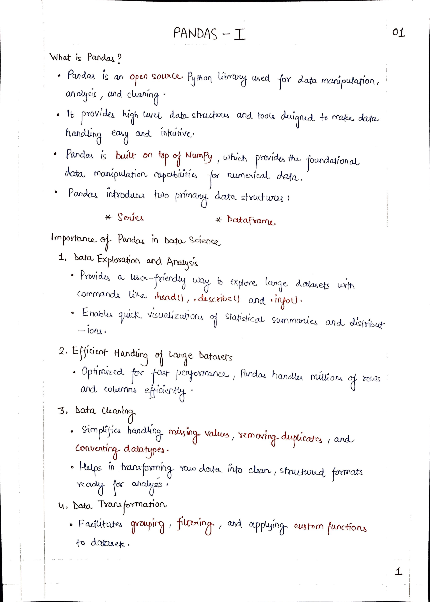
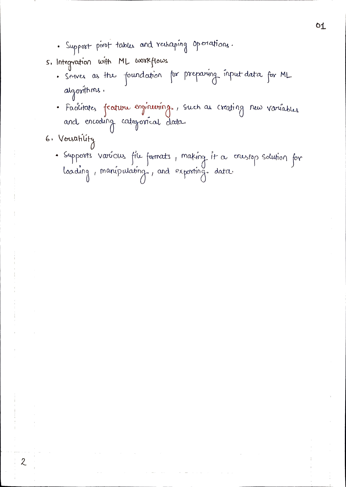

# <picture> <source srcset="https://numpy.org/images/logo.svg" type="image/webp">  </picture> Pandas for Data Science 

> [!TIP]  
> Link to Previous Article  
> 🡸 [Structured Arrays and Saving/Loading NumPy Objects](/Numpy/Articles/100_structured_arrays.md)

## Pandas Introduction

> [!TIP]  
> Link to Next Article  
> 🡺 [Series - A Pandas Data Structure](../Articles/102_series.md)