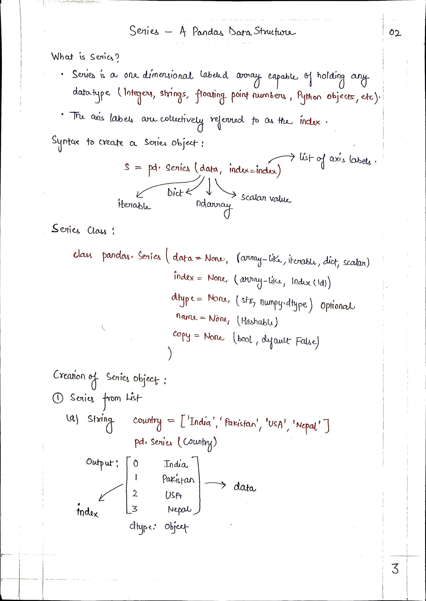
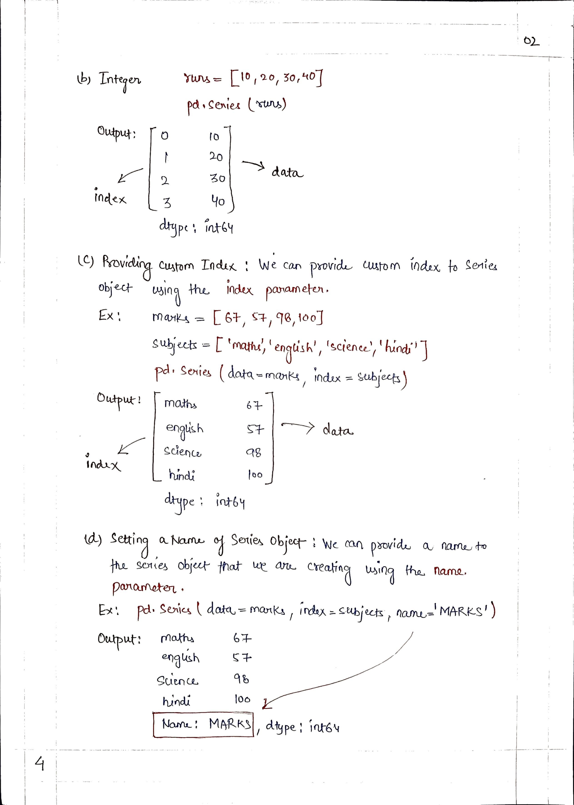
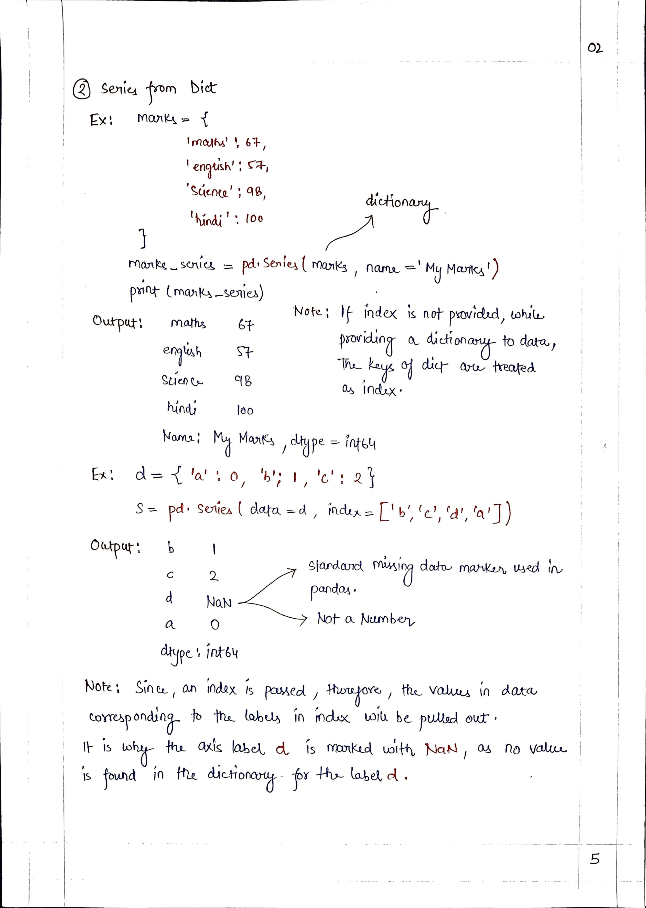
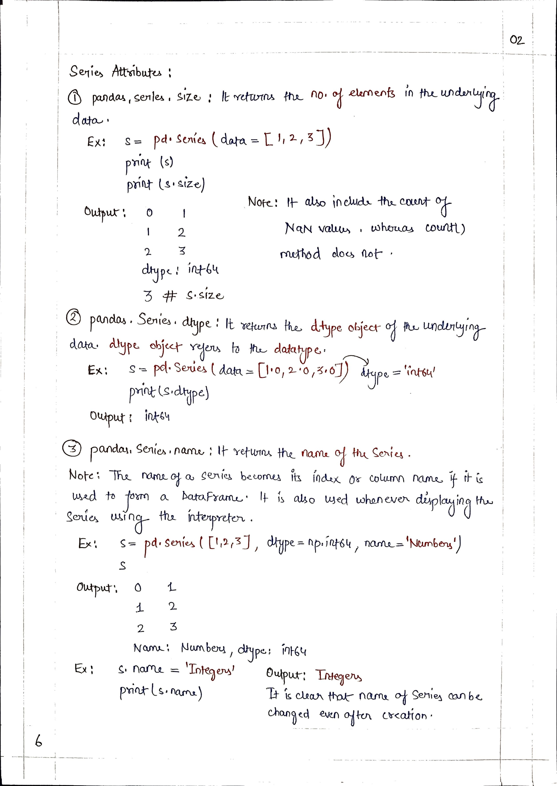
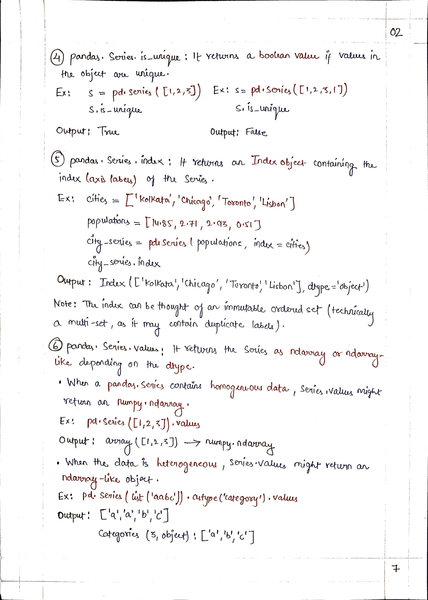

# <picture> <source srcset="https://pandas.pydata.org/static/img/pandas_mark_white.svg" type="image/webp">  </picture> Pandas for Data Science 
> [!TIP]  
> Link to Previous Article  
> 🡸 [Pandas Introduction](../../Pandas/Articles/101_pandas_introduction.md)

## Series - A Pandas Data Structure

> [!TIP]  
> Link to Next Article  
> 🡺 [Creating Series from CSV](../Articles/103_creating_series_from_csv.md)