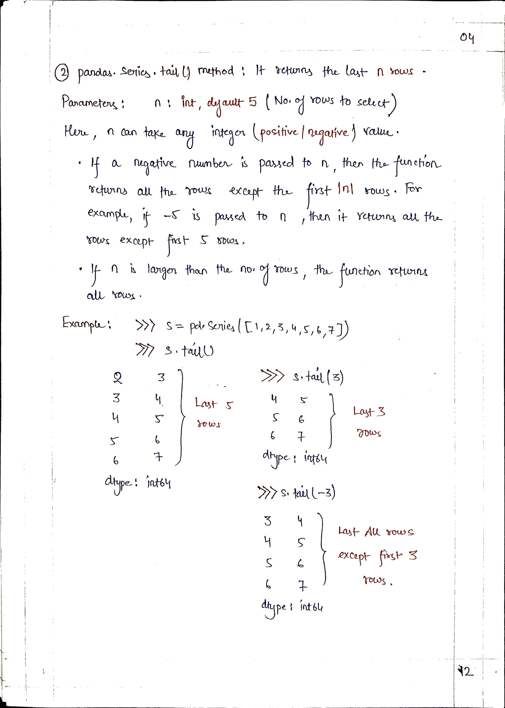
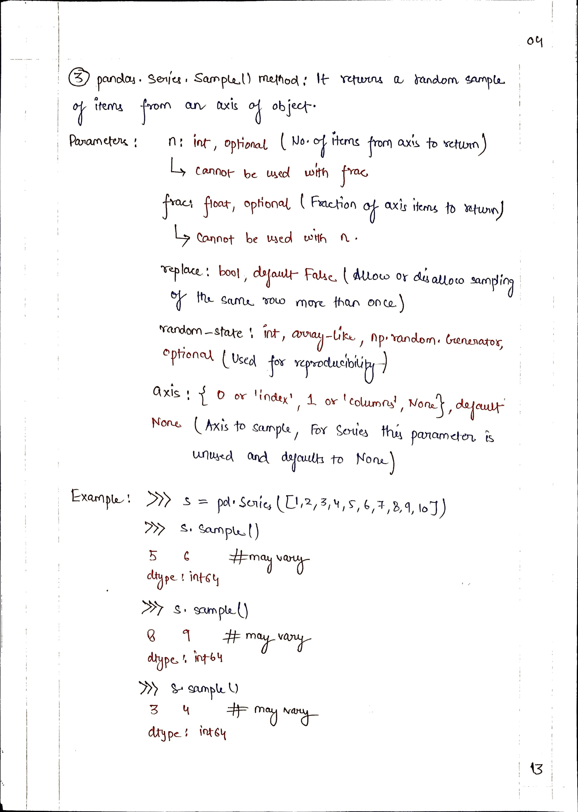
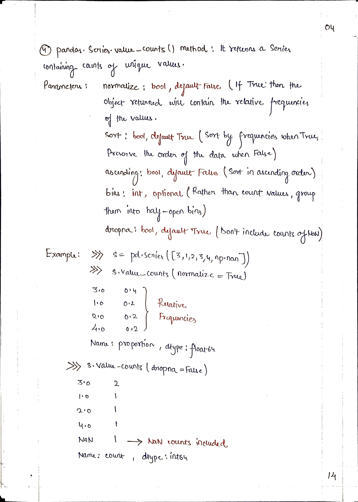
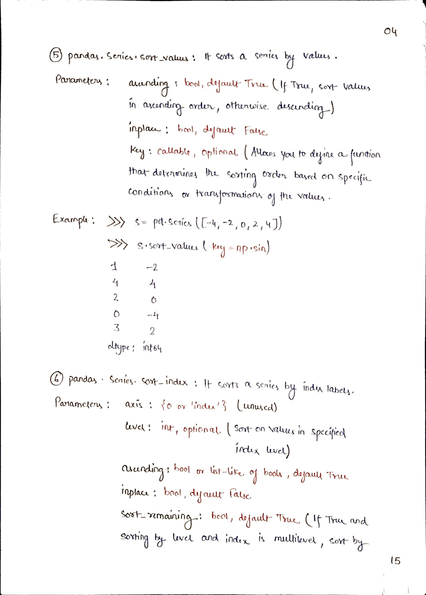
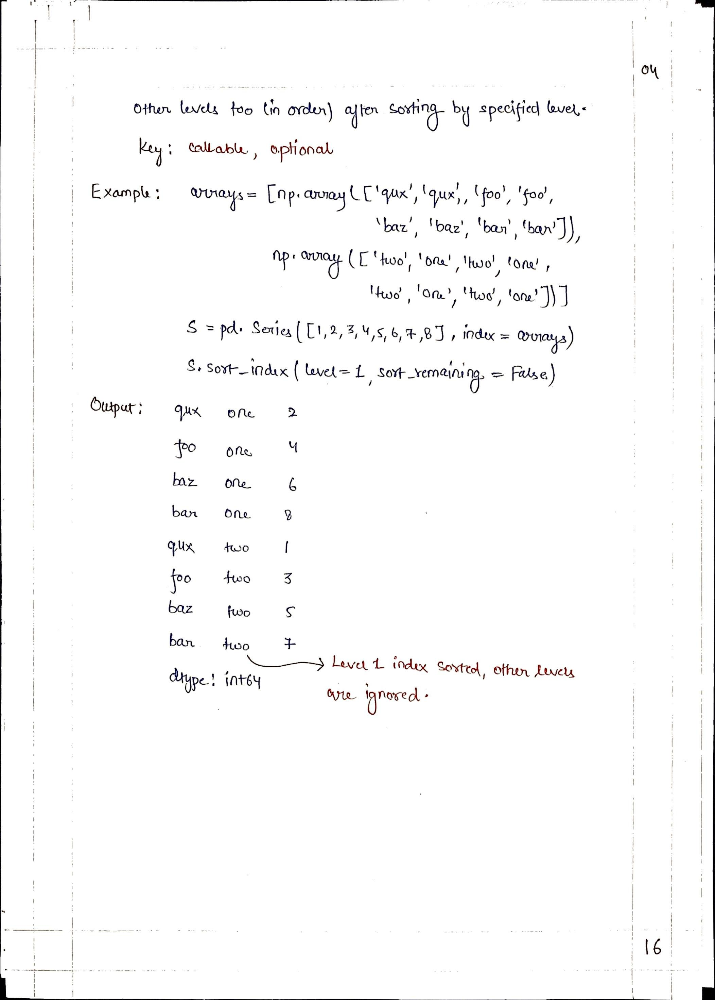

# <picture> <source srcset="https://numpy.org/images/logo.svg" type="image/webp">  </picture> Pandas for Data Science 

> [!TIP]  
> Link to Previous Article  
> 🡸 [Creating Series from CSV](../Articles/103_creating_series_from_csv.md)

## Series Methods

 
 
 
 
 

> [!TIP]  
> Link to Next Article  
> 🡺 [Series Mathematical Methods](../Articles/105_series_mathematical_methods.md)