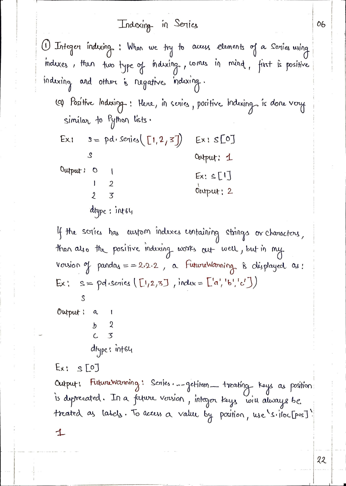
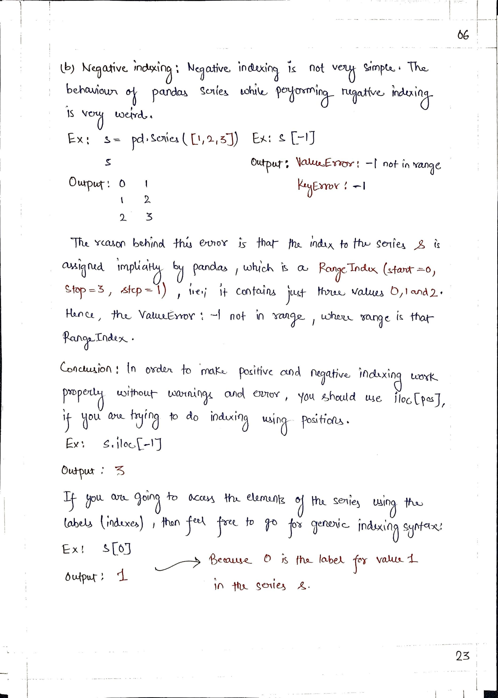
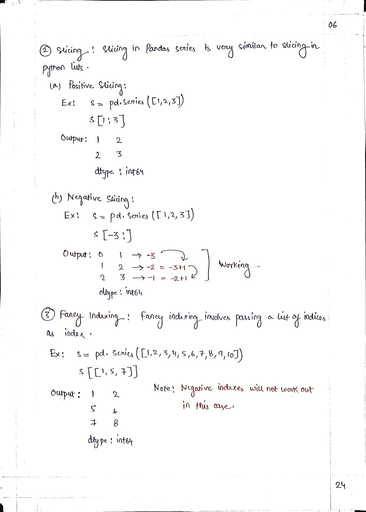

# <picture> <source srcset="https://pandas.pydata.org/static/img/pandas_mark_white.svg" type="image/webp">  </picture> Pandas for Data Science 
> [!TIP]  
> Link to Previous Article  
> 🡸 [Series Mathematical Methods](../Articles/105_series_mathematical_methods.md)

## Indexing in Series

 
 

> [!TIP]  
> Link to Next Article  
> 🡺 [Editing Series](../Articles/107_editing_series.md)