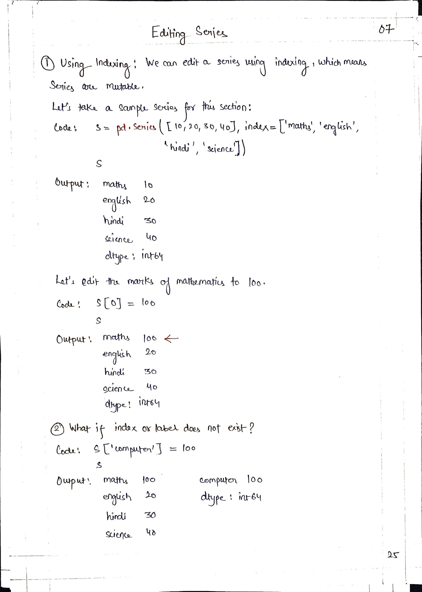
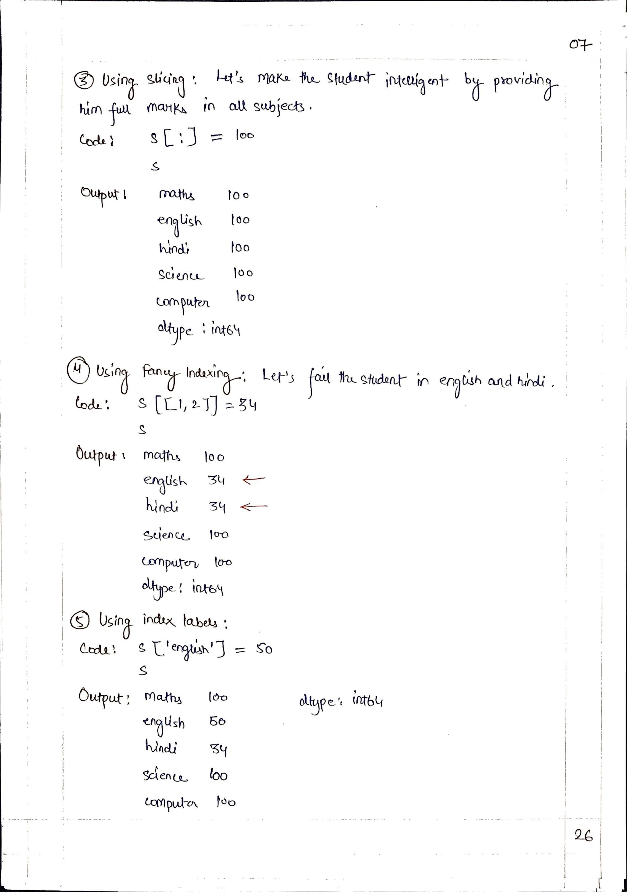

# <picture> <source srcset="https://numpy.org/images/logo.svg" type="image/webp">  </picture> Pandas for Data Science 

> [!TIP]  
> Link to Previous Article  
> 🡸 [Indexing in Series](../Articles/106_indexing_in_series.md)

## Editing Series

 

> [!TIP]  
> Link to Next Article  
> 🡺 [Python Functionalities on Series](../Articles/108_python_functionalities_on_series.md)