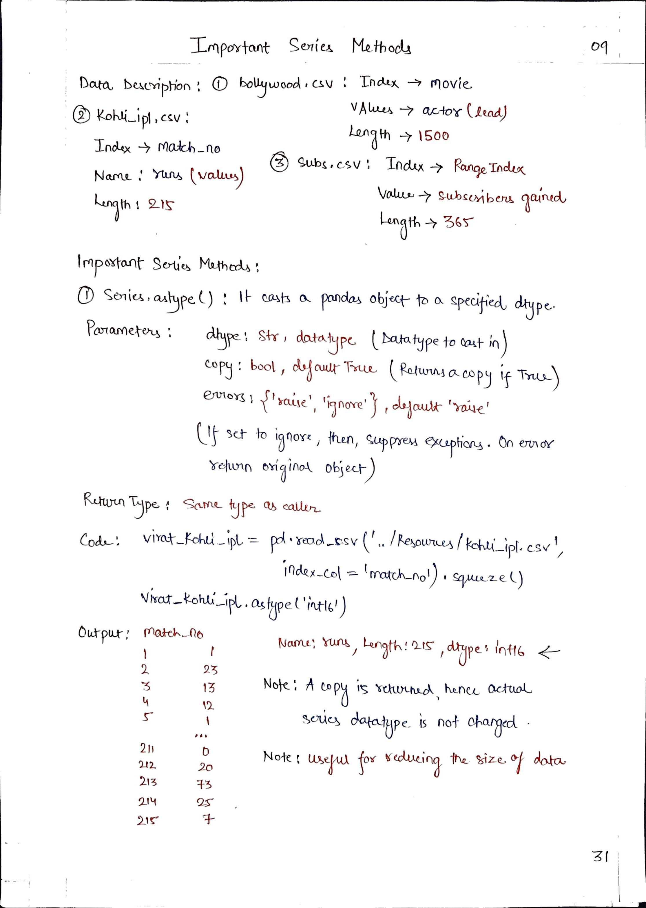
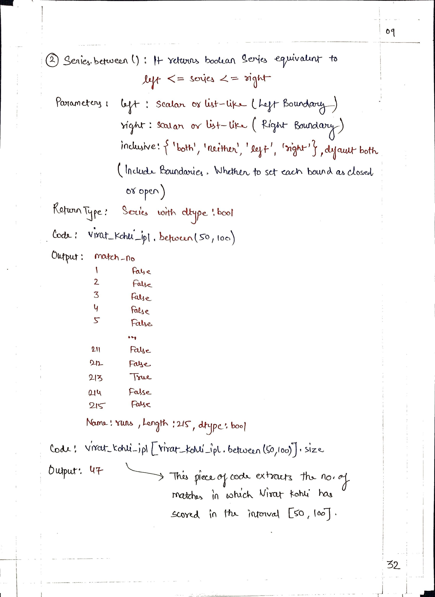
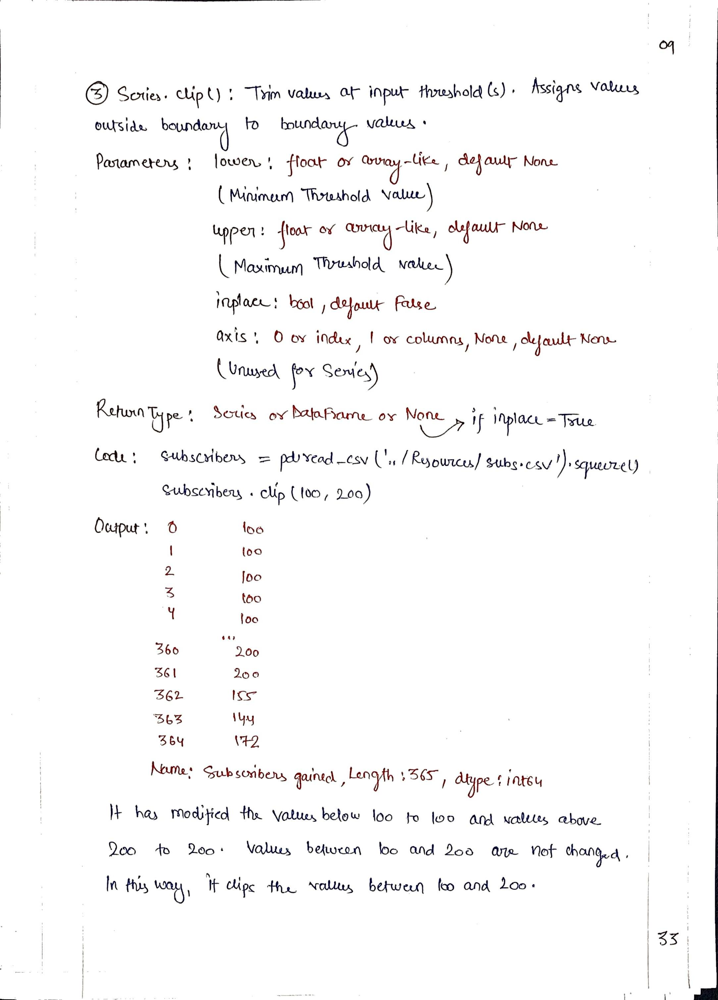
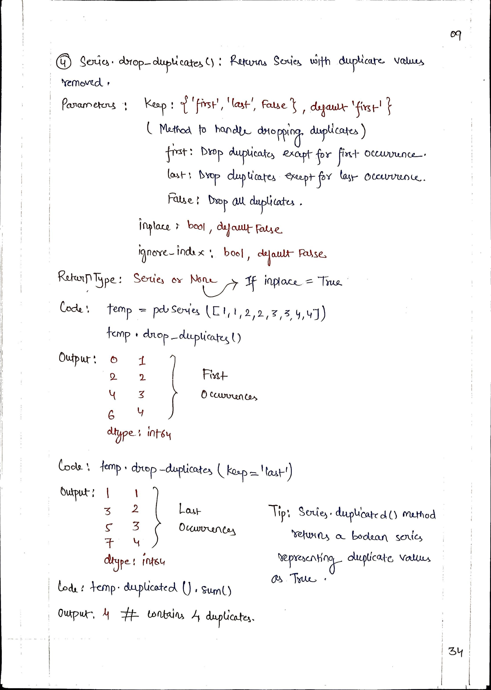
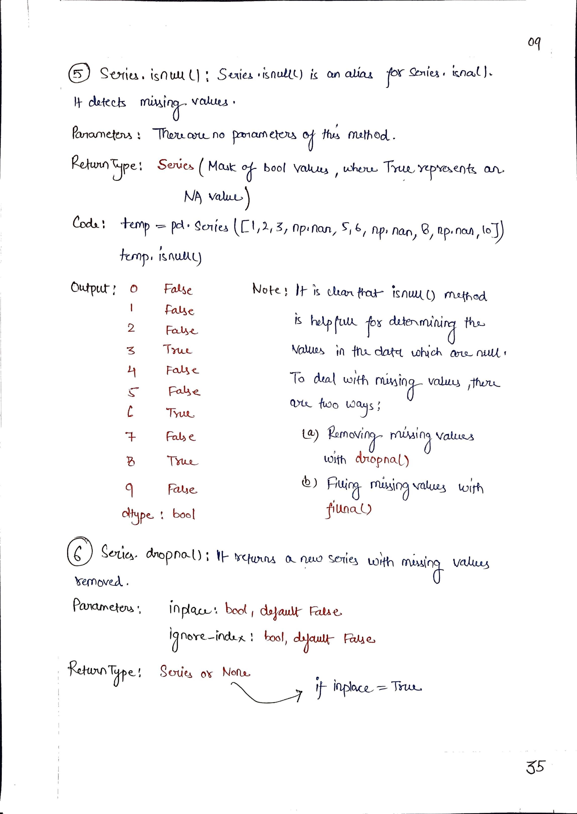
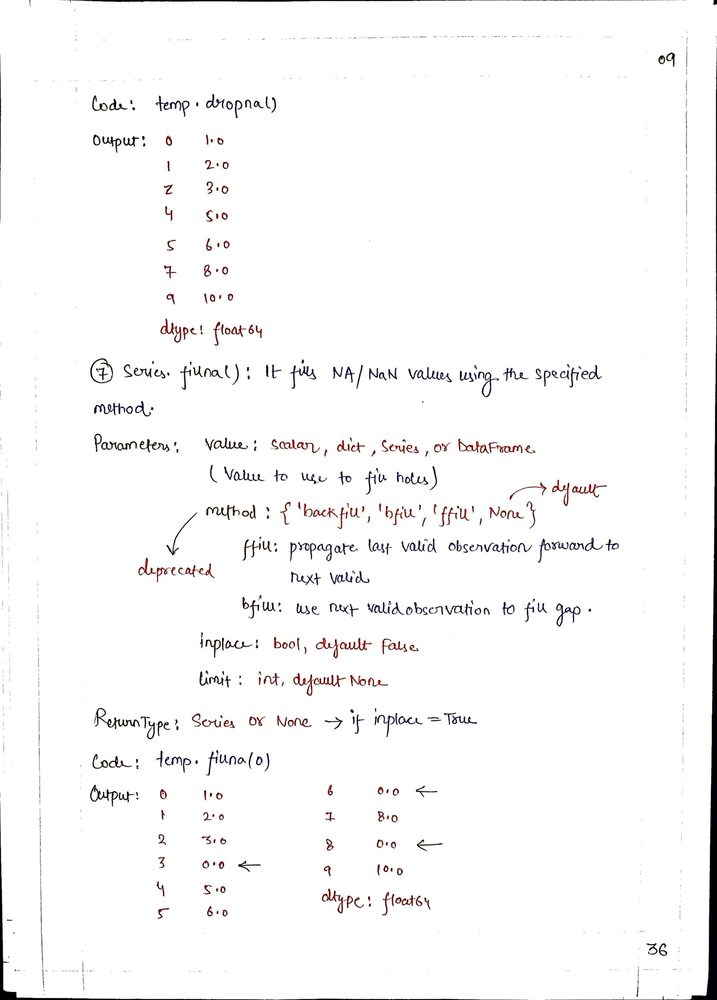
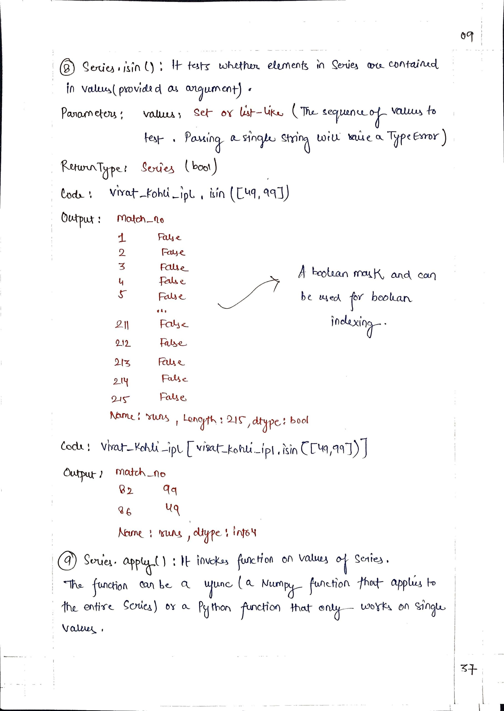
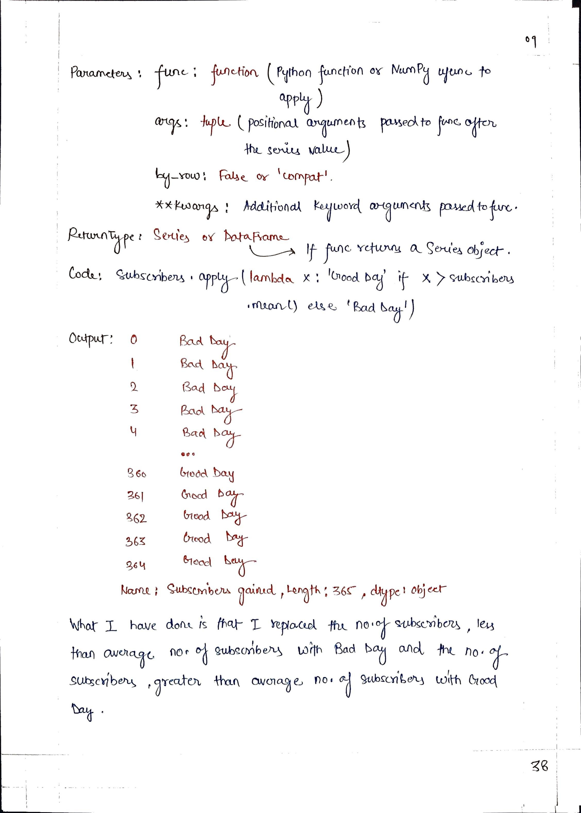
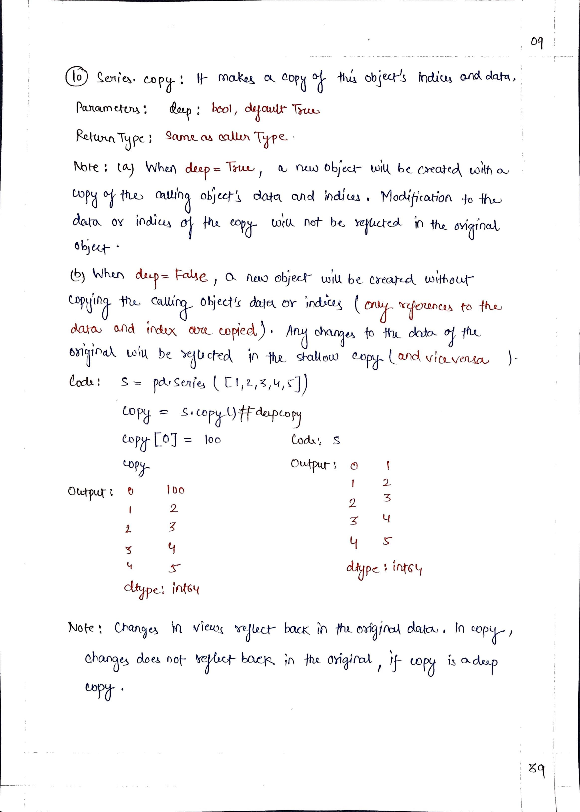

# <picture> <source srcset="https://pandas.pydata.org/static/img/pandas_mark_white.svg" type="image/webp">  </picture> Pandas for Data Science 

> [!TIP]  
> Link to Previous Article  
> 🡸 [Python Functionalities on Series](../Articles/108_python_functionalities_on_series.md)

## Important Series Methods

 
 
 
 
 
 
 
 

> [!IMPORTANT]  
> If you have studied Article 101-109, I would suggest you to perform some task so that you can check on your learning. Here is the link : [Task 16](/Pandas/Tasks/task_16.ipynb)

> [!TIP]  
> Link to Next Article  
> 🡺 [DataFrame - A Pandas Data Structure](../Articles/110_dataframes.md)