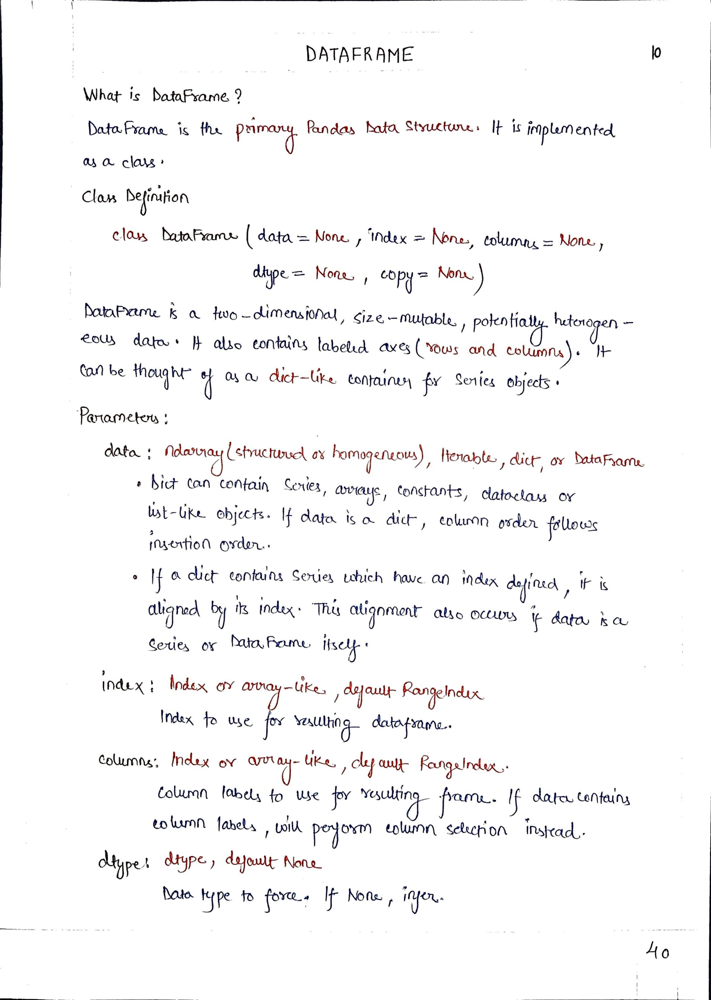
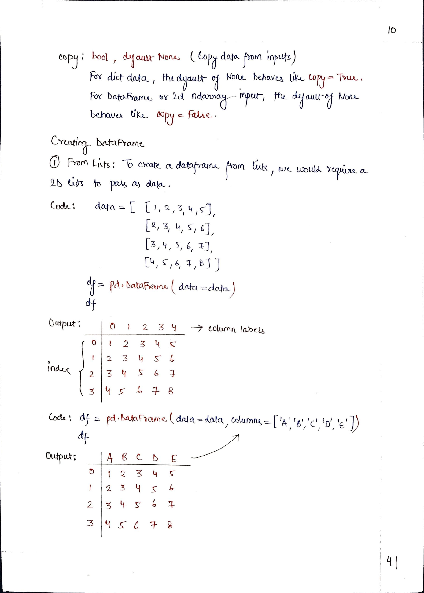
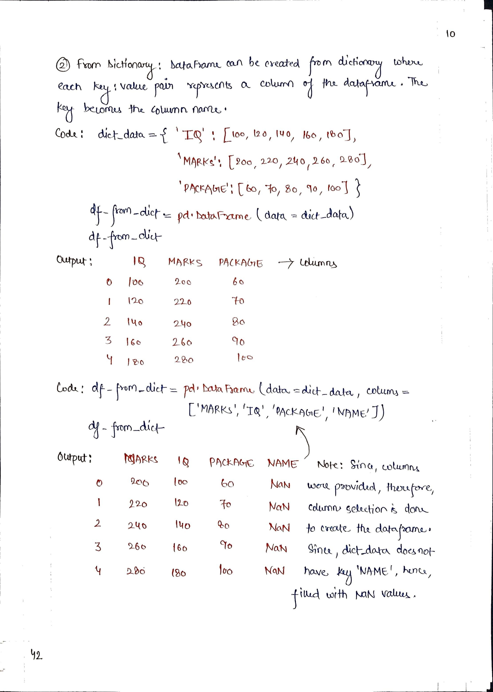
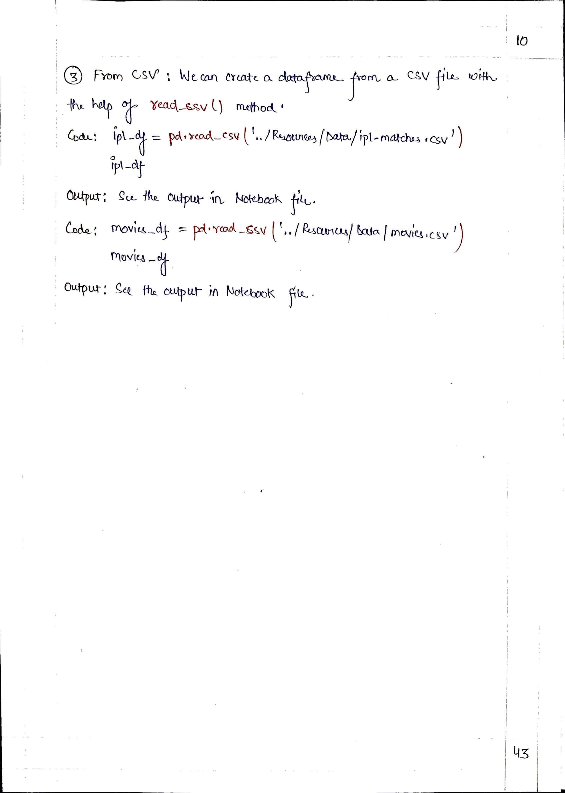

# <picture> <source srcset="https://pandas.pydata.org/static/img/pandas_mark_white.svg" type="image/webp">  </picture> Pandas for Data Science 

> [!TIP]  
> Link to Previous Article  
> 🡸 [Important Series Methods](../Articles/109_important_series_methods.md)

## DataFrame - A Pandas Data Structure

> [!IMPORTANT]  
> Link to Notebook of this article for practical implementation.
> [DataFrame](../Notebooks/110_dataframes.ipynb)

 
 
 

> [!TIP]  
> Link to Next Article  
> 🡺 [DataFrame Attributes and Methods](./111_dataframes_attributes_methods.md)