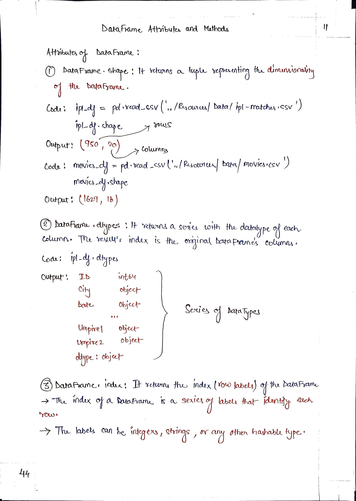
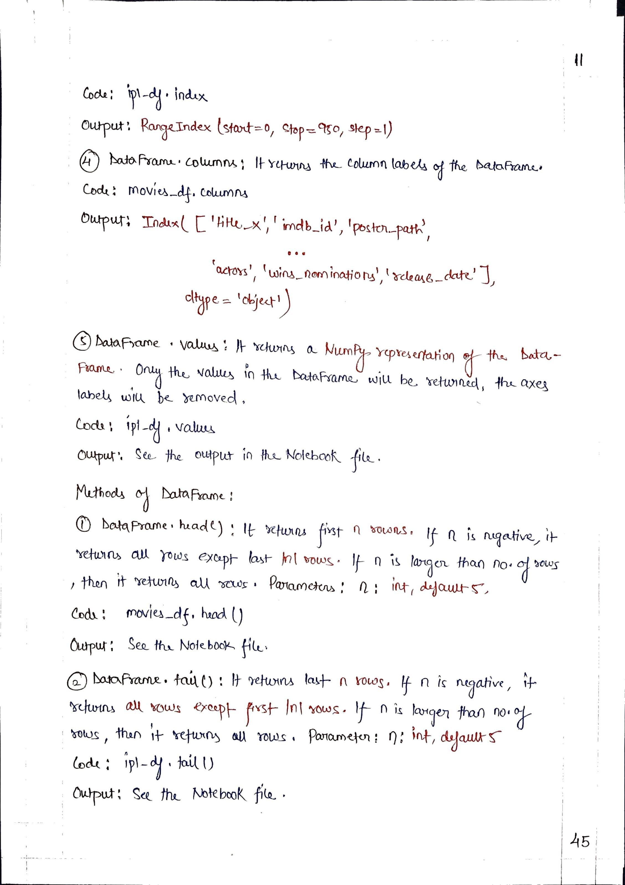
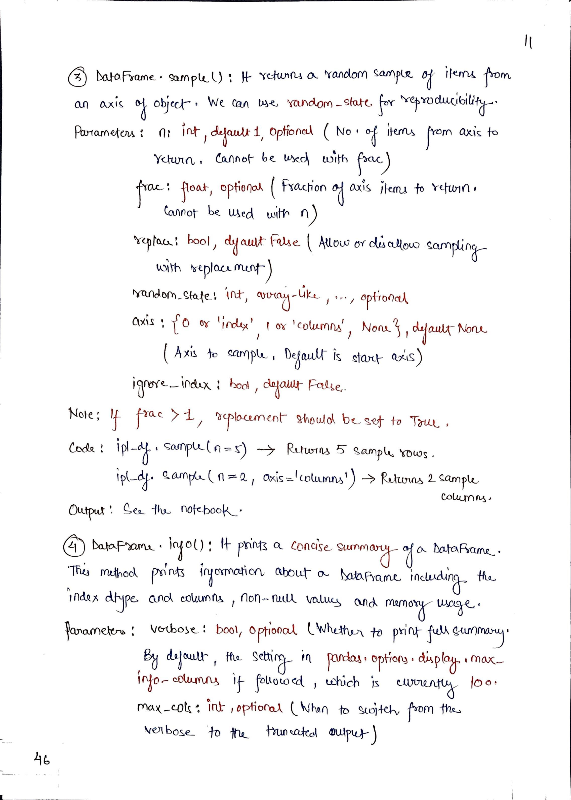
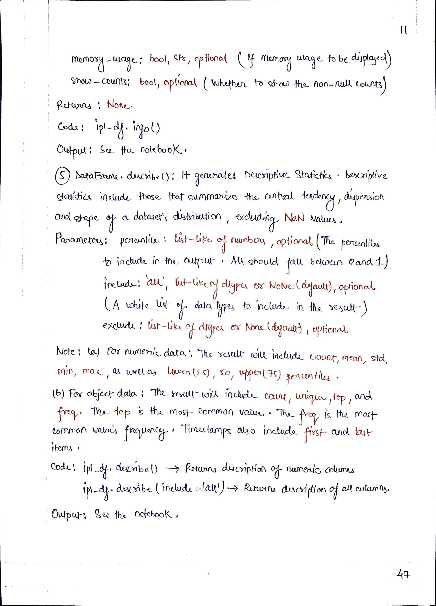
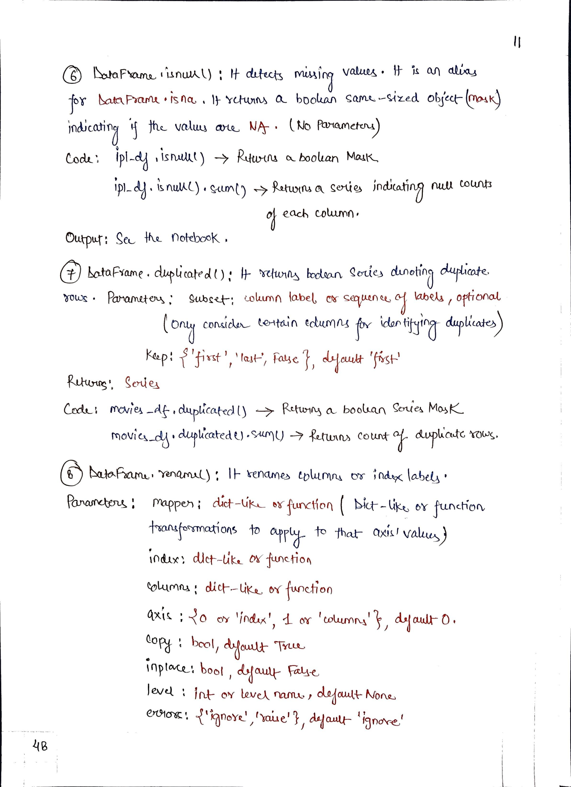

# <picture> <source srcset="https://pandas.pydata.org/static/img/pandas_mark_white.svg" type="image/webp">  </picture> Pandas for Data Science 

> [!TIP]  
> Link to Previous Article  
> 🡸 [DataFrame - A Pandas Data Structure](../Articles/110_dataframes.md)

## DataFrame Attributes and Methods

> [!IMPORTANT]  
> Link to Notebook of this article for practical implementation.
> [DataFrame](../Notebooks/111_dataframes_attributes_and_methods.ipynb)

 
 
 
 

> [!TIP]  
> Link to Next Article  
> 🡺 [DataFrame Mathematical Methods](./112_dataframes_mathematical_methods.md)