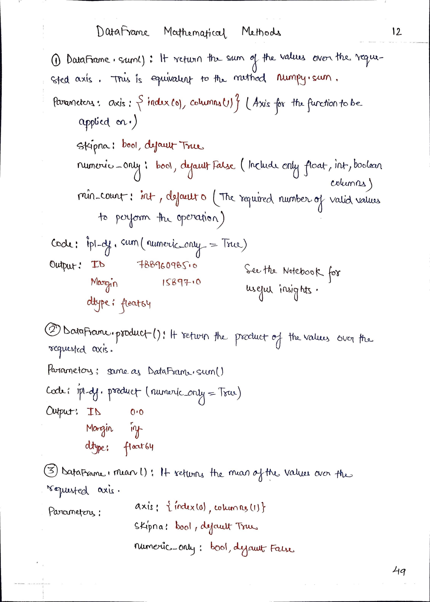
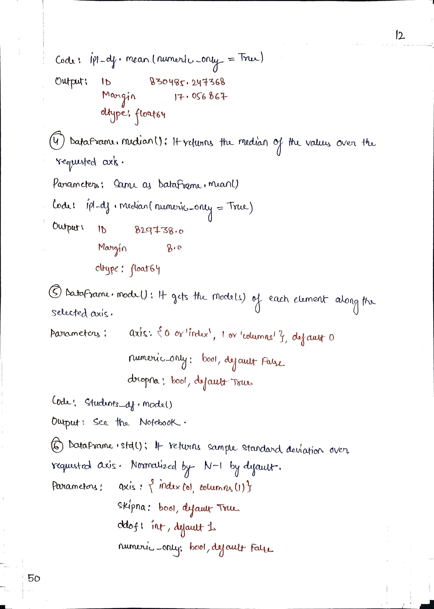
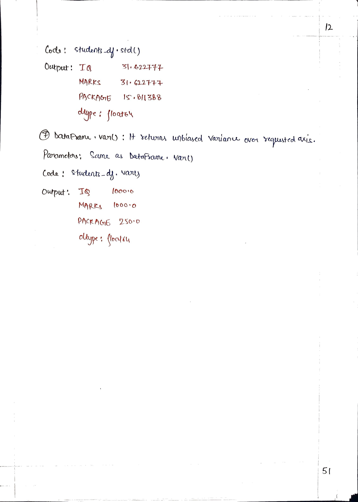

# <picture> <source srcset="https://pandas.pydata.org/static/img/pandas_mark_white.svg" type="image/webp">  </picture> Pandas for Data Science 

> [!TIP]  
> Link to Previous Article  
> 🡸 [DataFrame Attributes and Methods](./111_dataframes_attributes_methods.md)

## DataFrame Mathematical Methods

> [!IMPORTANT]  
> Link to Notebook of this article for practical implementation.
> [DataFrame](../Notebooks/112_dataframes_mathematical_methods.ipynb)

 
 

> [!TIP]  
> Link to Next Article  
> 🡺 [Selecting Rows & Columns](./113_selecting_rows_and_columns.md)