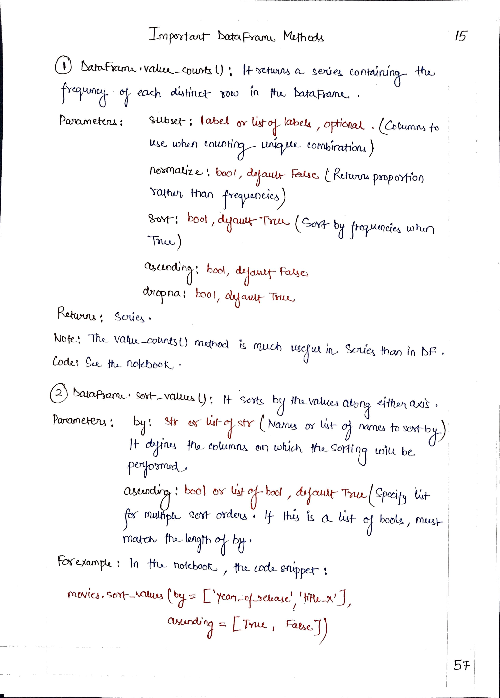
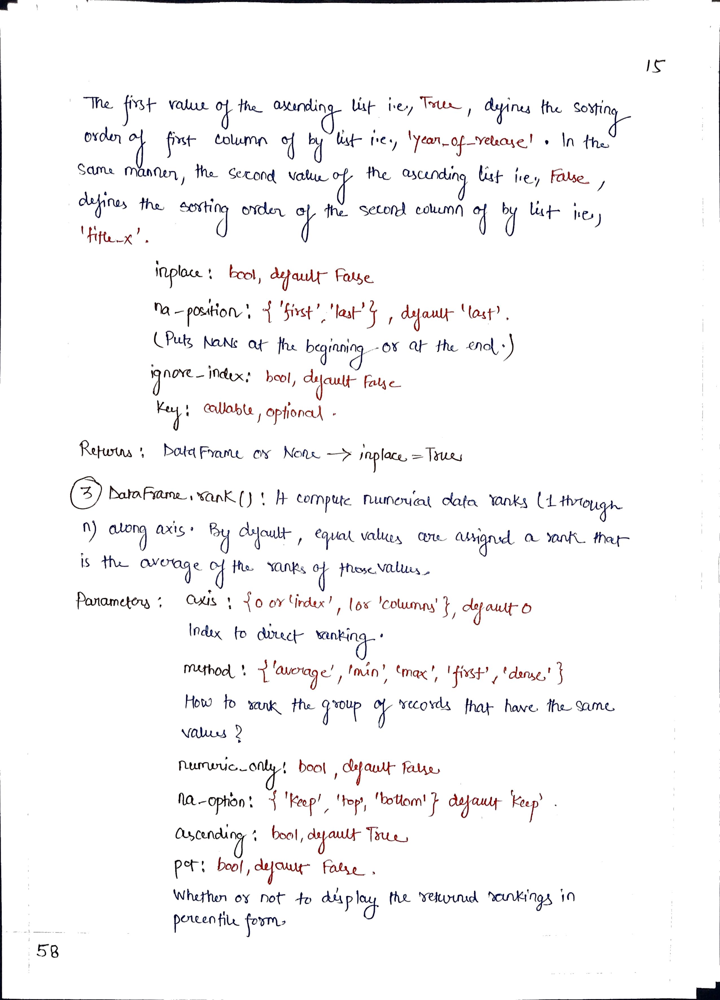
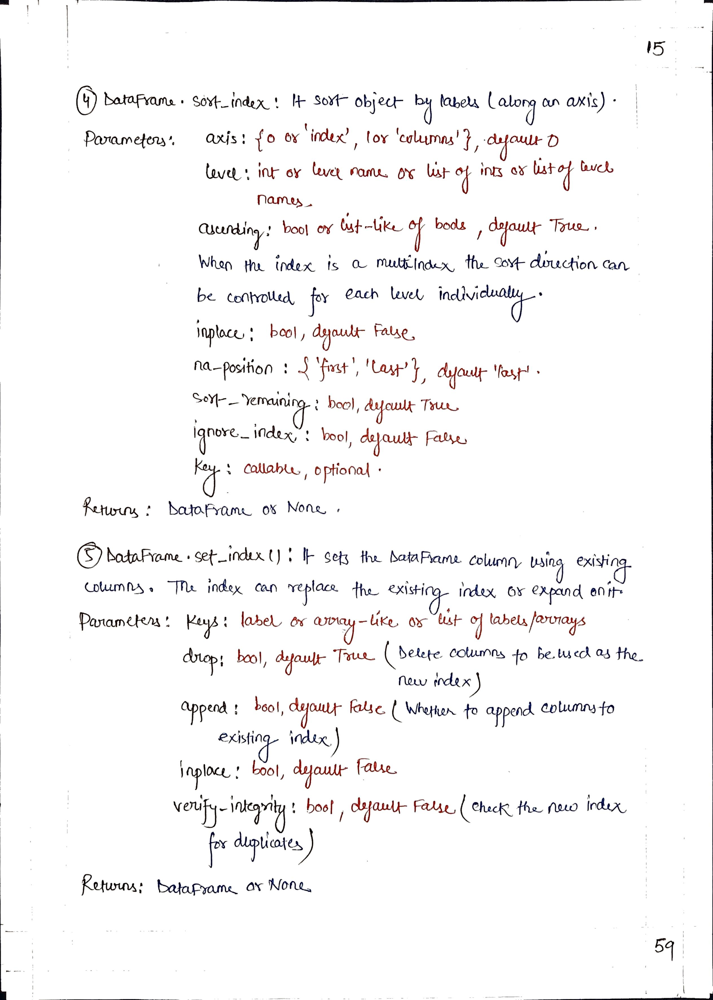
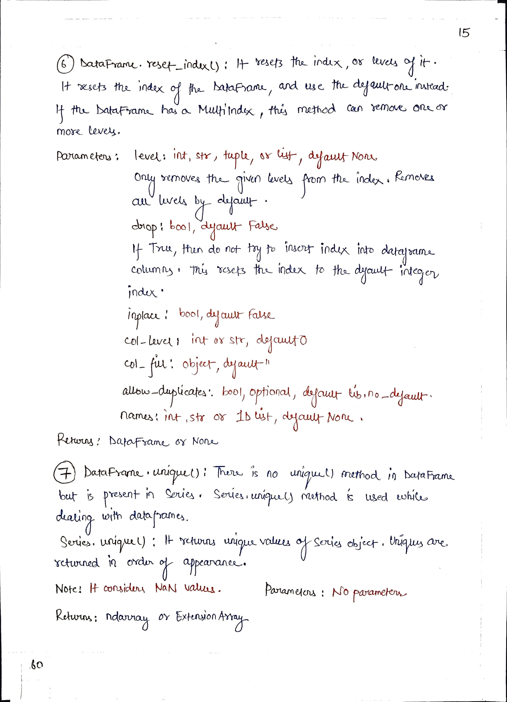
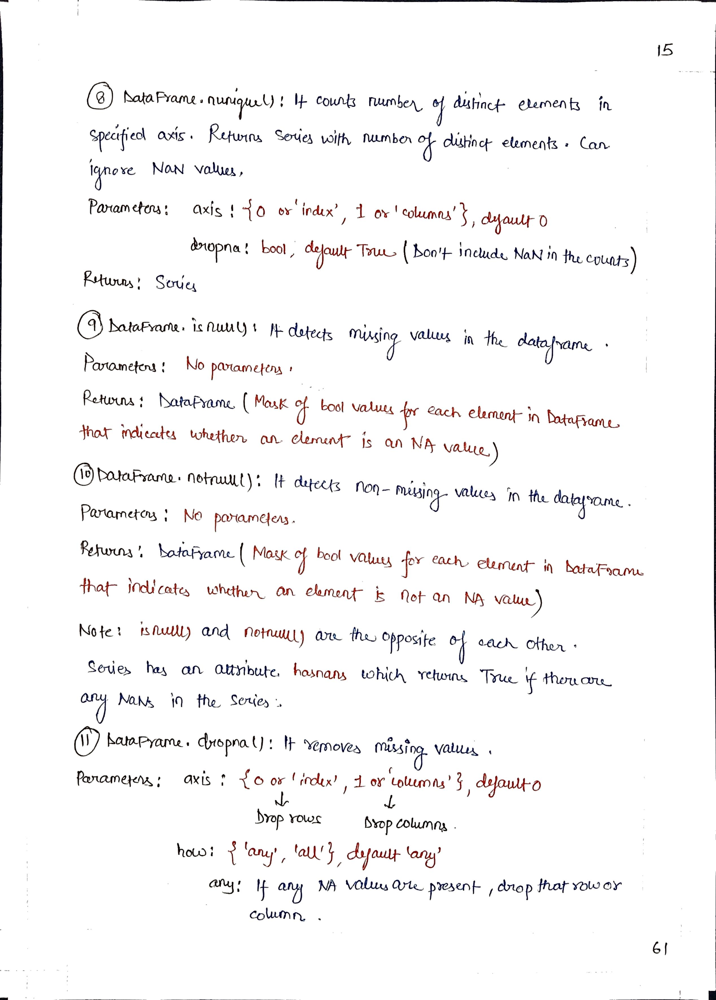
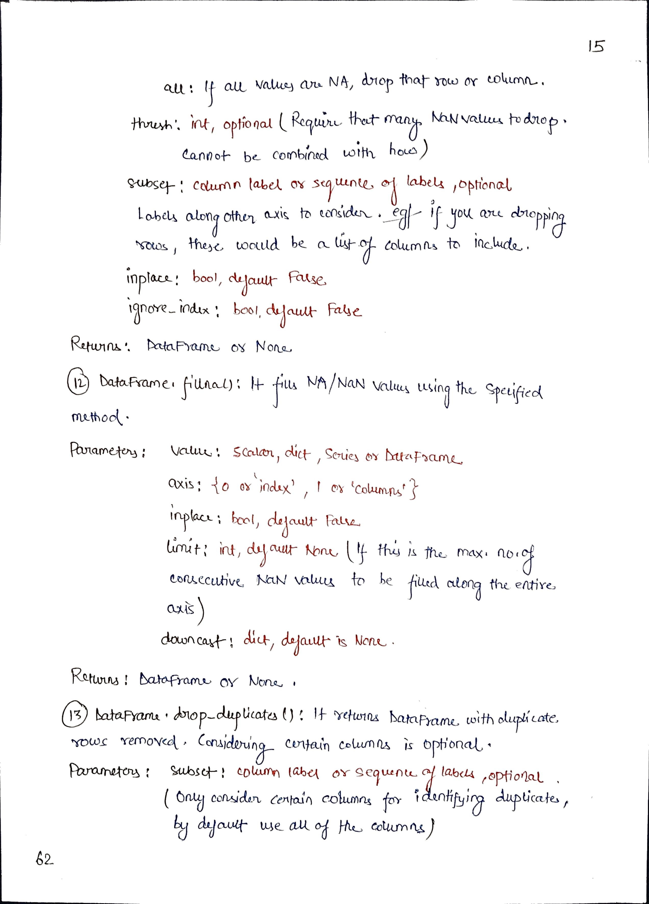
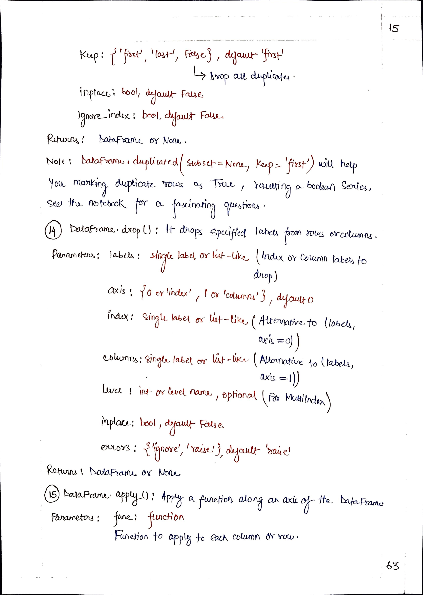
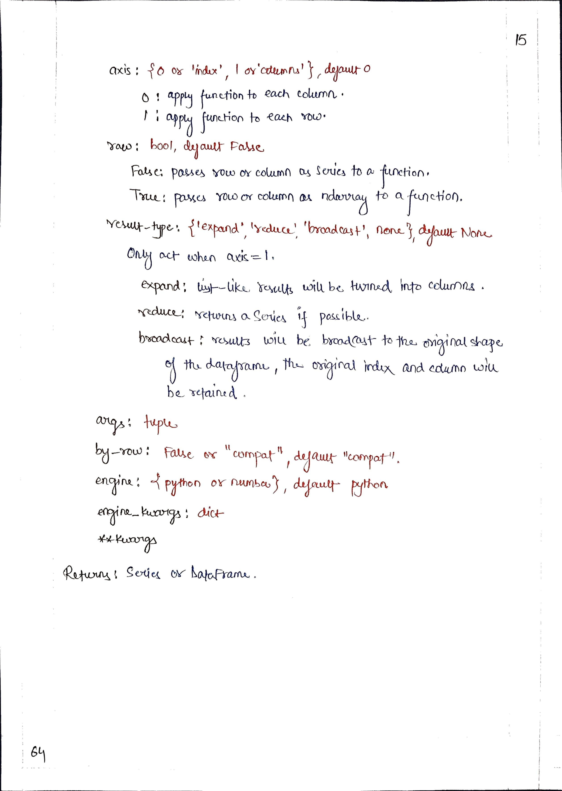

# <picture> <source srcset="https://pandas.pydata.org/static/img/pandas_mark_white.svg" type="image/webp">  </picture> Pandas for Data Science 

> [!TIP]  
> Link to Previous Article  
> 🡸 [Filtering a DataFrame](./114_filtering_in_dataframe.md)

## Important DataFrame Methods

> [!IMPORTANT]  
> Link to Notebook of this article for practical implementation.
> [Important DataFrame Methods](../Notebooks/115_important_dataframe_methods.ipynb)

 
 
 
 
 
 
 

> [!IMPORTANT]  
> If you have studied Article 115, I would suggest you to perform some task so that you can check on your learning. Here is the link : [Task 18](/Pandas/Tasks/task_18.ipynb)

> [!TIP]  
> Link to Next Article  
> 🡺 [GroupBy Object in Pandas](./116_groupby_object.md)