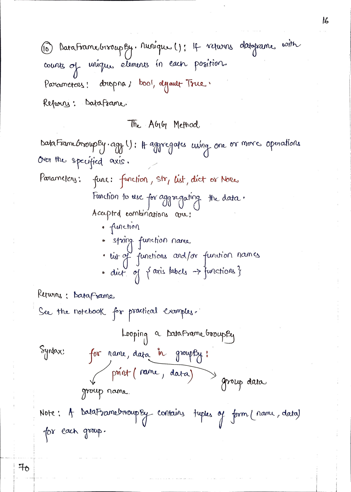

# <picture> <source srcset="https://pandas.pydata.org/static/img/pandas_mark_white.svg" type="image/webp">  </picture> Pandas for Data Science 

> [!TIP]  
> Link to Previous Article  
> 🡸 [Important DataFrame Methods](./115_important_dataframe_methods.md)

## GroupBy Object in Pandas

> [!IMPORTANT]  
> Link to Notebook of this article for practical implementation.
> [Important DataFrame Methods](../Notebooks/116_groupby_object.ipynb)

 
 
 
 
 
 

> [!IMPORTANT]  
> If you have studied Article 116, I would suggest you to perform some task so that you can check on your learning. Here is the link : [Task 19](/Pandas/Tasks/task_19.ipynb)

<!-- > [!TIP]  
> Link to Next Article  
> 🡺  -->