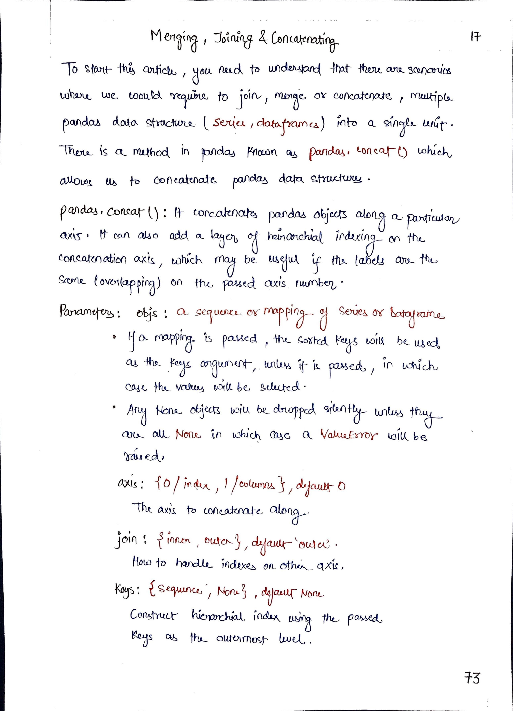
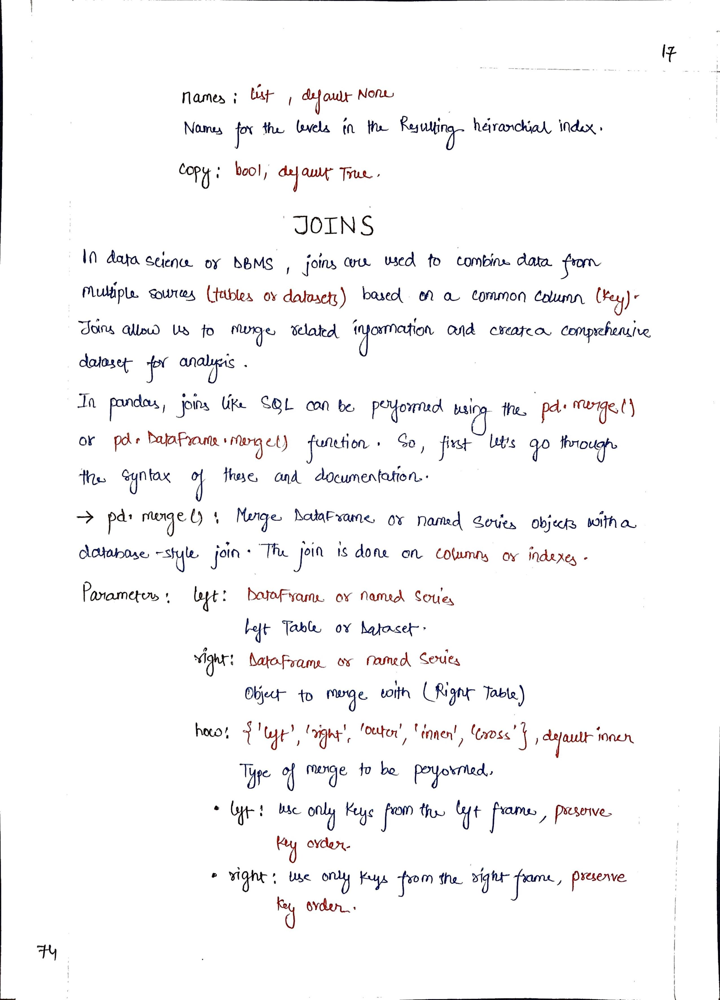
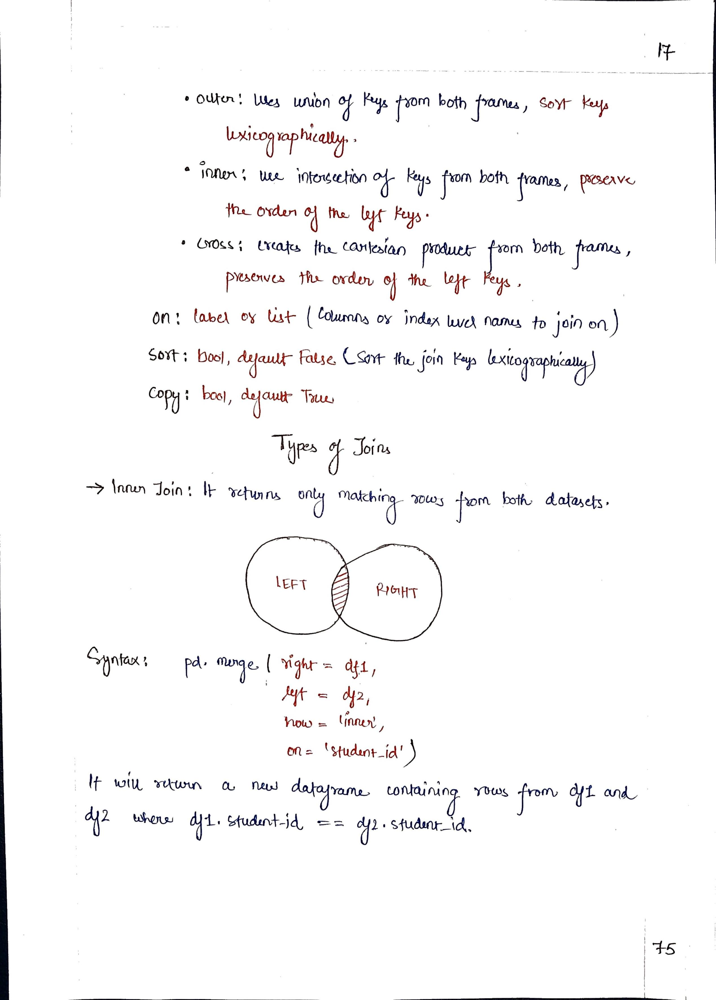
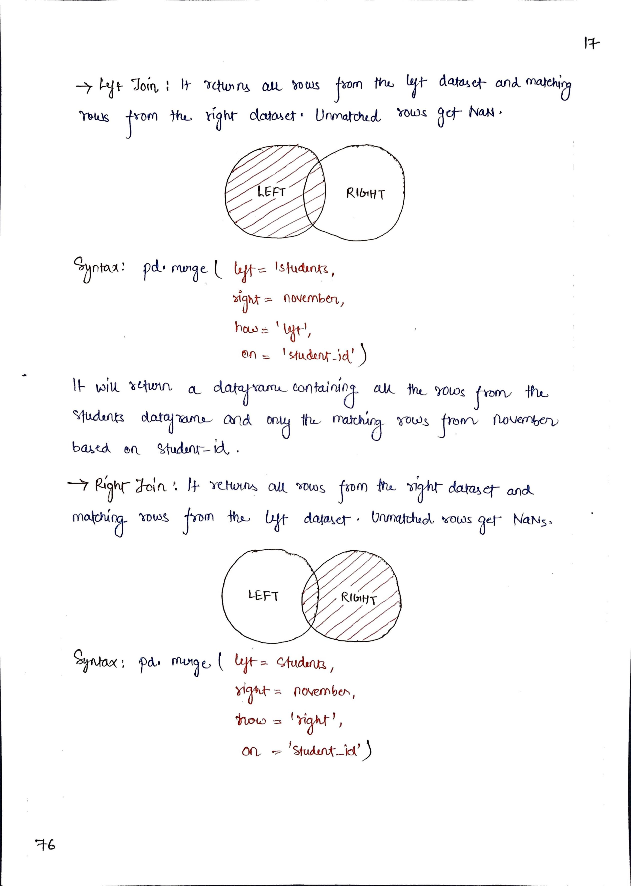
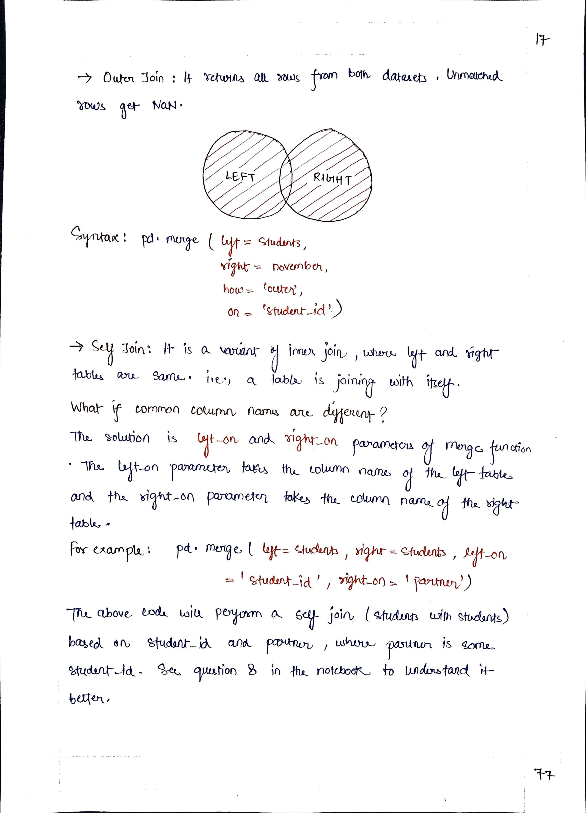

# <picture><source srcset="https://pandas.pydata.org/static/img/pandas_mark_white.svg" type="image/webp"></picture> Pandas for Data Science

> [!TIP]  
> Link to Previous Article  
> 🡸 [GroupBy Object in Pandas](./116_groupby_object.md)

## Merging, Joining & Concatenating

> [!IMPORTANT]  
> Link to Notebook of this article for practical implementation.
> [Important DataFrame Methods](../Notebooks/117_merging.ipynb)  

 
 
 
 

> [!IMPORTANT]  
> If you have studied Article 117, I would suggest you to perform some task so that you can check on your learning. Here is the link : [Task 20](/Pandas/Tasks/task_20.ipynb)

<!-- > [!TIP]  
> Link to Next Article  
> 🡺  -->