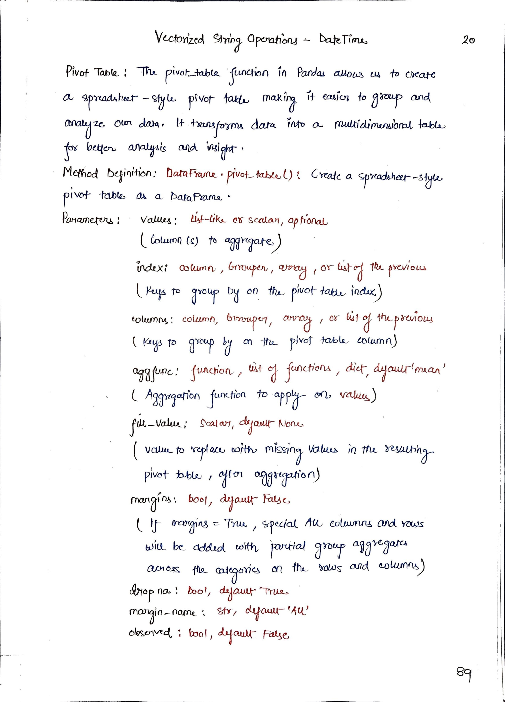
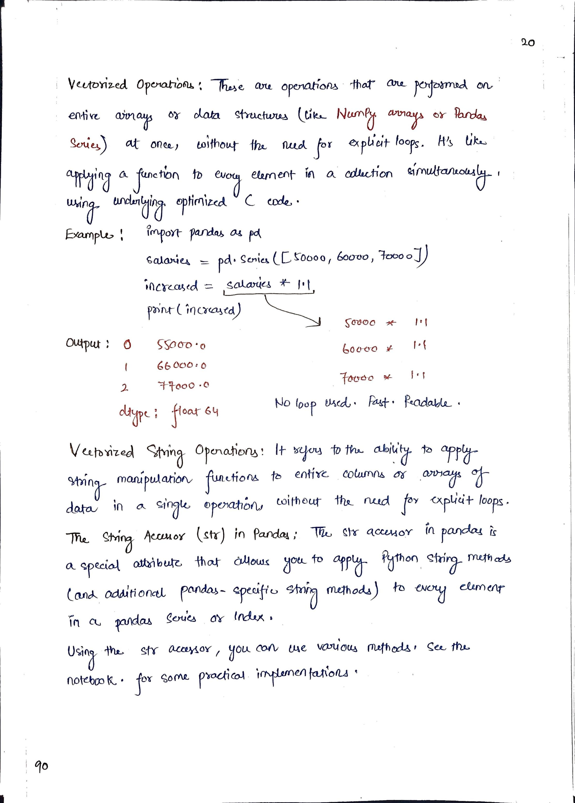
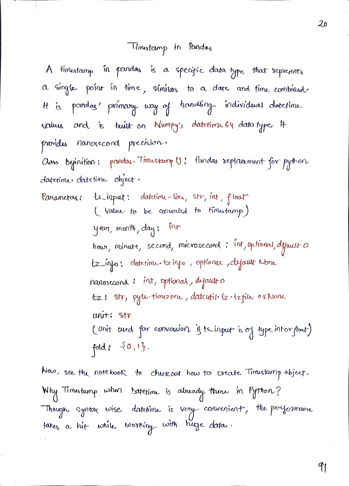
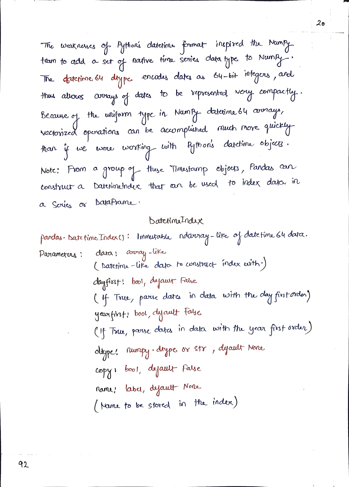

# <picture><source srcset="https://pandas.pydata.org/static/img/pandas_mark_white.svg" type="image/webp"></picture> Pandas for Data Science

> [!TIP]  
> Link to Previous Article  
> 🡸 [MultiIndex Series and DataFrames](../../Pandas/Articles/119_multiindex_series_and_dataframes.md)

## Vectorized String Operations & DateTime in Pandas

> [!IMPORTANT]  
> Link to Notebook of this article for practical implementation.
> [Vectorized String Operations & DateTime in Pandas](../Notebooks/120_vectorized_strings_datetime.ipynb)  

 
 
 

> [!IMPORTANT]  
> If you have studied Article 120, I would suggest you to perform some task so that you can check on your learning. Here is the link : [Task 22](/Pandas/Tasks/task_22.ipynb)

> [!TIP]  
> Link to Next Article  
> 🡺 [Time Series Analysis on Google Stock Data](../CaseStudies/TimeSeriesAnalysis/Articles/121_casestudy02_time_series_analysis.md)